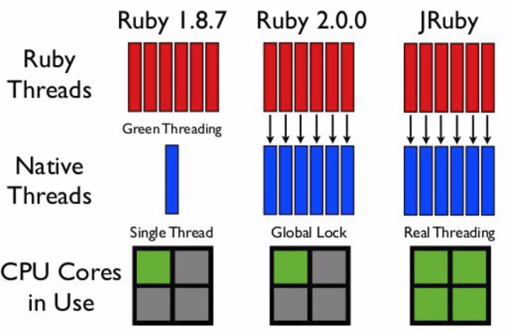

# Clase 1
Clase introductoria a la materia.
## Conceptos básicos de Arquitectura
La arquitectura es un proceso de construcción que cambia con el tiempo. Como característrica es:
- **Iterativa** (aumentar complejidad según necesidad, empezar un BD en archivos, luego embebida, etc.)
- **Constructiva**
- Verificable (validable de forma rápida, mediante métricas, depende del dominio la exigencia)
- **Holística** (considerando la parte humana: economía, finanzas, políticas por acuerdos con empresas)
- **Potenciada por la tecnología** (no reinventar la rueda, entender la problemática, pero tampoco hacer supermercado de tecnologías)
- **Enriquecido por la historia** 

***"Diseñar en términos de módulos, diseño físico (hardware y despliegue)"***

## Cualidades Arquitectónicas
- **KISS**
- Mantenible
- Resuelve el problema
- **No sobrediseñar**
- **YAGNI**

## Concurrencia y paralelismo
Paralelismo no implica concurrencia y concurrencia no implica paralelismo.

### Paralelismo
El **paralelismo** es la ejecución simultánea de dos o más operaciones. Se trata de una propiedad que permite a los programas ejecutarse más rápido, y requiere un soporte **físico**. Es una cuestión **no funcional**.

No requiere comunicación entre participantes, **ya están asignados los recursos, por ende no trae tantos problemas**, como sí la concurrencia.

- **A nivel de bit**: ¿Por qué las computadoras de 64 bits son más rápidas que las de 16 bits? Si un equipo de 16 bits quiere realizar una suma de dos números de 32 bits, debe realizar una serie de operaciones de 16 bits, pero una computadora de 64 bits, puede realizar y soportar las mismas operaciones que las de 32, 16 y 8 bits, ya que utilizan los registros de acuerdo a su longitud.

- **A nivel instrucción**: Los procesadores, mediante técnicas como pipelining, ejecución fuera de orden y ejecución especulativa, permiten ejecutar varias operaciones en simultáneo. Este tipo de optimización queda encapsulada a este nivel, es decir, funciona "por atrás" sin que el usuario lo sepa. Procurar que todos los resultados se vean como si la ejecución hubiese sido secuencial.

- **A nivel datos**: SIMD (“single instruction, multiple data”), esta arquitectura es capaz de llevar a cabo la misma operación sobre una gran cantidad de datos en paralelo. Este tipo de ejecución no es útil para todos los problemas, pero sí para varias áreas, como el procesamiento de imágenes (especialmente en videojuegos), y el entrenamiento de modelos de deep learning. Por esta razón, las GPUs (unidades gráficas de procesamiento) se han desarrollado como procesadores de datos paralelos especiales

- **A nivel tareas**: múltiples procesadores, múltiples threads, a los que pueden enviarsele múltiples tareas. *Memoria compartida* en el procesador y conexion entre procesadores mediante red o bus.

### Concurrencia
La **concurrencia** se da cuando se tienen múltiples **contextos de ejecución**. Es una propiedad **lógica**. Por ejemplo, si tenemos un procesador de texto, mientras escribimos, en segundo plano tendremos tareas que validan la ortografía. **Independiente del paralelismo**.

La concurrencia es naturalmente una fuente de **no determinismo**, dado que el orden de ejecución de los distintos contextos de ejecución puede variar, ej. **condiciones de carrera**.

## Manejo de concurrencia: Green Threads vs. OS Threads vs. OS Processes
Siempre que haya memoria compartida es necesario sincronizar los threads. Existen múltiples formas de manejar la concurrencia.

### Green Threads
---

**Green Thread**: como un thread, pero el kernel ni se entera de que existe. Lo maneja el runtime del lenguaje (Go, Erlang, etc.) en espacio de usuario. Súper barato de crear y de cambiar, podés tener miles. La contra: si no lo maneja bien el runtime, uno bloqueado puede trabar a los demás. El **desalojo** depende del runtime:
- Si es **cooperativo** (el caso clásico, como los viejos green threads o el `async/await` de Python): nadie te desaloja. Vos decidís cuándo cedés el lugar (con un `yield`, un `await`, una operación de I/O). Si nunca cedés, te quedás para siempre y bloqueás a todos los demás que comparten tu OS thread.
- Si el runtime es más sofisticado (como las goroutines de Go desde hace unas versiones): el propio runtime puede desalojarte igual, metiendo chequeos en puntos del código para forzar la cesión aunque vos no lo pidas explícitamente.

### OS Threads
---

**OS Thread**: vive dentro de un proceso, comparte memoria con sus hermanos. El kernel lo gestiona y lo puede correr en paralelo real (otro núcleo de CPU). Más barato que un proceso, pero sigue constando algo crearlo y cambiar entre ellos. El kernel puede desalojar en cualquier momento.

Usada por la **JVM**, al hacer `new Thread()`, eso mapea 1:1 a un thread del SO, el **modelo tradicional** por excelencia. Nota aparte: desde Java 21 metieron **virtual threads** (Project Loom), que sí son más parecidos a **green threads** (livianos, gestionados por la JVM).

**Ruby (MRI/CRuby, el intérprete estándar)**: tiene OS threads, pero con un GIL (Global Interpreter Lock) — solo un thread ejecuta código Ruby a la vez, aunque tengas varios núcleos. Da concurrencia (podés intercalar tareas, útil para I/O) pero no paralelismo real de CPU. Para paralelismo real en Ruby, la gente usa procesos (ej: forking, o servidores como Unicorn/Puma en modo cluster).

### OS Processes 
---

**Proceso**: un programa corriendo, con su memoria propia. Si se cae, no afecta a otros. Es "caro" crearlo. El kernel puede desalojar en cualquier momento.

**JRuby**: es Ruby corriendo sobre la JVM. Como aprovecha la JVM, no tiene GIL — sus threads son OS threads reales de la JVM, con paralelismo real entre núcleos. Es la gran diferencia práctica vs. MRI.

### Bonus: Executors
---

Un executor es una capa de abstracción arriba de todo esto — vos le pedís "ejecutá esta tarea" y él decide cómo y con qué (thread, pool de threads, etc.), sin tener que manejar la creación/destrucción a mano. Es un **gestor** que usa por debajo el modelo que ya existe (OS threads, típicamente).

**La idea central**: en vez de hacer `new Thread()` cada vez que se quiere correr algo (caro, y si lo hacés sin control te quedás sin memoria/recursos), le pasás la tarea a un **pool de threads ya creados** que el executor administra y reutiliza.

**Por qué existe**: crear/destruir OS threads es caro. Si tenés miles de tareas cortas, no querés pagar ese costo miles de veces. El executor amortiza ese costo reutilizando threads.

**En una frase**: el executor es el "*encargado de turnos*" — vos le dejás tareas en una bandeja, y él las reparte entre un número limitado de threads (workers) que ya están vivos y esperando, en vez de que cada tarea traiga su propio thread nuevo.

Con virtual threads (Java 21+) esto cambia un poco: como son tan baratos de crear, a veces conviene un executor que crea un virtual thread *por tarea* en vez de reusar un pool fijo — porque ya no hay tanto costo que amortizar.

Che, ¿te referís al **bulkhead pattern**? Es re común confundirlo/tipearlo así, y encaja perfecto con lo que veníamos hablando de executors.

**Bulkhead Pattern** La idea viene de los barcos: un barco se divide en compartimentos estancos (*bulkheads*). Si uno se inunda, el agua no pasa a los demás y el barco no se hunde entero,a plicado a software: **aislás recursos (como thread pools) por tipo de tarea**, para que si una parte falla o se satura, no tumbe todo el sistema.

Si un servicio que hace dos cosas:
- Llama a una API externa lenta.
- Consulta tu propia base de datos, rápida.

Si usás **un solo executor/pool compartido** para ambas cosas, y la API externa se cuelga, todos los threads del pool quedan esperando esa API colgada → tu consulta rápida a la DB también se queda sin threads disponibles, aunque no tenga nada que ver. Todo el sistema se frena por culpa de una sola dependencia lenta.

Con **bulkhead**: le das un pool de threads separado a cada tarea.
- Pool A (chico) → llamadas a la API externa.
- Pool B (otro) → consultas a la DB.

Si la API externa se cuelga y satura el Pool A, el Pool B sigue funcionando normal. El "compartimento" que se inunda no ahoga a los demás.

**En una frase**: bulkhead es separar tus executors/pools por tipo de tarea o dependencia, para que la falla o saturación de una no contagie a las otras.

¿Era esto o me tiraste una posta distinta con "bulk pattern"? Si es otra cosa contame más contexto.

## Conclusiones de laboratorio
Puma es un server HTTP levantado sobre ruby, es mulit hilo, multio prceso. En MRI existe un Global VM Lock que se asegura que solo un hilo puede correr a la vez. Pero si haces mucho IO bloquante Puma mejor MRI permitiendo IO esperar para hacerlo en paralelo.
Puma aunque se levante un solo proceso al menos levanta 6-7 hilos. No es que vaya a utilizar todos, solo los levanta, si lo levantás con 1 hilo usa 1 hilo.}

MRI tiene global lock, es una version del intérprete de ruby.
Jruby es otra version del intérprete y no tiene global lock.

Puma se levanta con `bundle exec puma -t 4:8 -w 2` siendo 4:8 el rango de hilos que se pueden levantar y 2 son los 2 procesos
### MRI
#### 1 - Puma: 1 proceso, 1 hilo
- Comportamiento de rutas CPU: Cuando ejecuto con 1 proceso, 1 hilo únicamente se usa ese hilo del proceso, los demás no se utilizan. 
- Comportamiento de rutas IO: Es como que levanta otro hilo
- Cantidad de threads: Se crean 7 hilos igualmente aunque le pongo 1:1
- Prueba con uno o varios clientes: Es lo mismo para CPU. 

#### 1 - Puma: 2 proceso, 1 hilo
- Comportamiento de rutas CPU: Se usa 1 hilo en cada proceso al 100%. El proceso usa su core y al 100% porque tiene el bloqueo global y el GIL (Global Interpreter Lock) es por proceso
- Comportamiento de rutas IO: Pasa lo mismo.
- Cantidad de threads: Se crean 7 hilos.
- Prueba con uno o varios clientes: Lo mismo.

### CONCURRENCIA Y PARALELISMO
#### MRI (Concurrencia pero con el truco tiene paralelismo) 
Cada proceso tiene un gestor. Cada proceso/worker/vm mapea 1:1 contra un core, con su propio GIL tiene sentido que lo levante 1:1.¿Puedo levantar más? Si, los levanta, dejemoslo de lado. 
Sigue siendo más performante, porque no tiene el overhead que tiene la JVM.

#### CPU 
Hay hilos de usuario y de kernel. Necesito tener el GIL porque tengo 
Con MRI no existe paralelismo, por cada proceso se ejecuta 1 hilo sin importar si se tienen 0 pegadas concurrentes, 5 o 200.
Cada proceso es una maquina virtual y tiene su propio GIL. Si tengo 2 procesos/workers y me entran 10 solicitudes vamos a ver que por proceso se toma 1 hilo porque cada proceso tiene su GIL. Entonces, dentro de cada proceso (VM) solo puedo ejecutar 1 hilo, cuando termina entra otro.
Hay concurrencia y paralelismo entre workers (hay una VM por worker con GIL) pero no paralelismo dentro de cada worker, entonces, en el SO HAY paralelismo, porque hay paralelismo y concurrencia entre workers.
Puma forkea cada VM, teniendo más de una VM (con multiples workers).
Hay paralelismo porque usa hilos de kernel, por cada hilo de ruby levanta un hilo de kernel porque la I/O puede ser más performante.

#### IO
Cuando hace un I/O, por ejemplo una consulta a red, suelta el lock, lo deja esperando hasta que lo necesite (cuando me viene la respuesta sigo trabajando). Puma crea un hilo burocrático que usa un poquito de CPU aunque sea solo IO, que pide al SO que haga IO o algunas tareas rápidas para finalmente invocar IO bound. Y al mismo tiempo cuando lo deja correr solo y no se queda esperand usa un poquito de CPU para poder hacer ese cambio.
Esa CPU poquita que se usa para poder hacer esta manganeta de cambiar y dejar que quede corriendo da el sentido de que use hilos de kernel.

### JRUBY (Concurrencia y paralelismo puro)
La JVM tiene más overhead, por lo que es menos performante.

#### CPU 
No existe el GIL.Es thread safe entre los threads porque son hilos de kernel, por eso no necesita GIL.
Es una única VM (JVM), usa SOLO HILOS DE KERNEL (No green threads), no hay workers, solo hay hilos. No existe un GIL, por ser todos hilos, entonces si tengo 10 solicitudes y 4 hilos, se toman las primeras 4/10 solicitudes que entran a los 4 hilos, luego las siguientes 4 (quedan 2) y finalmente esas 2 mientras dos hilos "descansan" (esto asumiento que terminan al mismo tiempo).

#### IO
La JVM se queda esperando, se bloquea el hilo.
