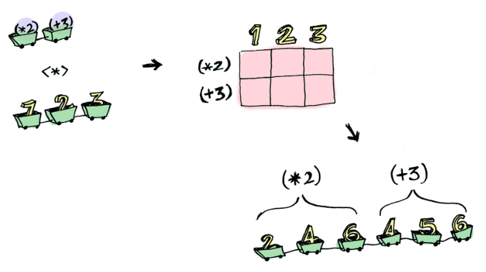
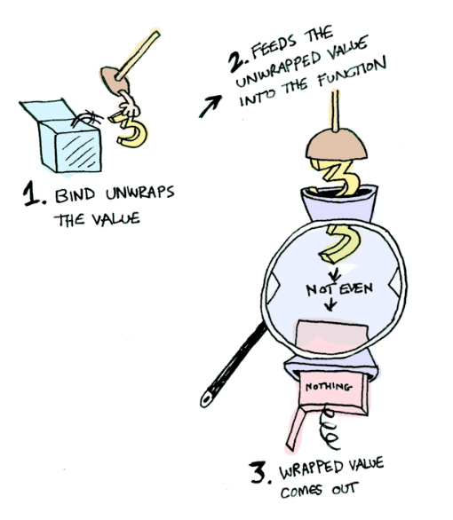
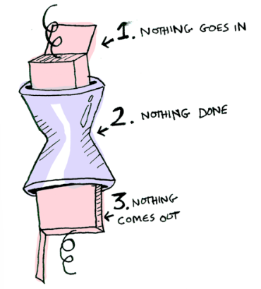
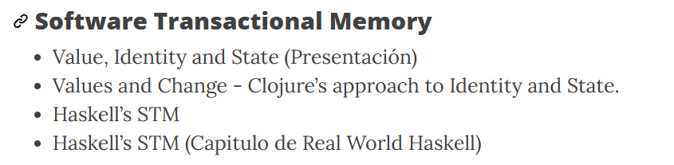

# Haskell
Quizás sea más útil pensarlo a partir de las características más frecuentemente evocadas cuando se piensa en éste:
- **Pureza**: las funciones, al igual que en matemática, no presentan efectos colaterales, sino que tan sólo reciben, operan y devuelven valores
- **Evaluación diferida**: ciertas partes del código no se evaluarán salvo que sea necesario
- **Funciones de primer orden**: las funciones son valores, y por tanto pueden ser pasadas por parámetro
- **Pattern matching**: los valores pueden ser descompuestos estructuralmente, en un proceso inverso a la construcción: la deconstrucción. Y además podemos usar a esta herramienta como mecanismo de control de flujo: según encaje un valor con un patrón u otro, podremos tomar acciones diferentes.
- **Expresiones lambda**: Es posible escribir valores de función de forma literal, sin asignarle un nombre.
- **Inmutabilidad**: las variables son meras etiquetas, que una vez unificadas contra un valor, no pueden ser cambiadas.

## Tipos

Conocer el tipo de un valor
```Haskell
Prelude> :t 'a'
```
```Haskell
Prelude> :t 4 + 3
4 + 3 :: Num a => a
```


```Haskell
succ :: Int -> Int
succ a = a + 1

Prelude> :t head
head :: [a] -> a

Prelude> :t tail
tail :: [a] -> [a]
```
En estos casos 'a' es un **tipo genérico**, pero el valor es **consistente**.


## Typeclasses
Es una interfaz que define un comportamiento. Si un tipo es parte de una typeclass, el tipo soporta e implementa el comportamiento que describe dicha typeclass, son como las interfaces de Java, pero implementando el comportamiento, no solo definiendo su contrato.
```Haskell
Prelude> :t (+)
(+) :: Num a => a -> a -> a
```

Antes que nada vemos que ahora está el símbolo =>. La lectura hacia la derecha es como las funciones que vimos hasta ahora: la función toma dos elementos de tipo a y devuelve otro de tipo a. A la izquierda del => se indica que el tipo de los dos valores y el retorno deben ser miembros de la clase Num. Esto último se conoce como **class constraint**.
```Haskell
Prelude> :t (<=)
(<=) :: Ord a => a -> a -> Bool
```

Ord es otra typeclass, que define la interfaz para ordenamiento (<, >, <= y >=, entre otras), por lo que cualquier tipo que requiera ordenamiento de dos o más elementos, debe ser un miembro de Ord.

## Sintaxis básica

| Elemento | Haskell |
|---|---|
| Comentario | `-- un comentario` / `{- un comentario multilínea -}` |
| Strings | `"uNa CadEna"` |
| Caracteres | `'a'` |
| Símbolos/Átomos | NA |
| Booleanos | `True` `False` |
| Set | NA |
| Lista | `[]` / `[1,2]` |
| Patrones de listas | `(cabeza:cola)` / `(cabeza:segundo:cola)` |
| Tuplas | `(comp1, comp2)` |
| Data/Functores | `Constructor comp1 comp2` |
| Bloques sin parámetros | NA |
| Bloques / Exp. lambda (un parámetro) | `(\x -> algo con x)` |
| Bloques / Exp. lambda (más de un parámetro) | `(\x y -> algo con x e y)` |
| Variable anónima | `_` |

## Operadores lógicos y matemáticos

| Operación | Haskell |
|---|---|
| Equivalencia | `==` |
| Identidad | NA |
| ~ Equivalencia | `/=` |
| Comparación de orden | `> >= < <=` |
| Entre valores | NA |
| Disyunción (O lógico) | `||` / `or` |
| Conjunción (Y lógico) | `&&` / `and` |
| Negación | `not unBool` |
| Operadores aritméticos | `+ - * /` |
| División entera | `div dividendo divisor` |
| Resto | `mod dividendo divisor` |
| Valor absoluto | `abs unNro` |
| Exponenciación | `base ^ exponente` |
| Raíz cuadrada | `sqrt unNro` |
| Máximo entre dos números | `max unNro otroNro` |
| Mínimo entre dos números | `min unNro otroNro` |
| Par | `even unNro` |
| Impar | `odd unNro` |

## Operaciones simples sin efecto sobre listas/colecciones

| Operación | Haskell |
|---|---|
| Longitud | `length :: [a] -> Int` ** / `genericLength :: Num n => [a] -> n` * |
| Si está vacía | `null :: [a] -> Bool` ** |
| Preceder (nueva cabeza) | `(:) :: a -> [a] -> [a]` |
| Concatenación | `(++) :: [a] -> [a] -> [a]` |
| Unión | `union :: Eq a => [a] -> [a] -> [a]` * |
| Intersección | `intersect :: Eq a => [a] -> [a] -> [a]` * |
| Acceso por índice | `(!!) :: [a] -> Int -> a` (base 0) |
| Pertenencia | `elem :: Eq a => a -> [a] -> Bool` ** |
| Máximo | `maximum :: Ord a => [a] -> a` ** |
| Mínimo | `minimum :: Ord a => [a] -> a` ** |
| Sumatoria | `sum :: Num a => [a] -> a` ** |
| Aplanar | `concat :: [[a]] -> [a]` ** |
| Primeros n elementos | `take :: Int -> [a] -> [a]` |
| Sin los primeros n elementos | `drop :: Int -> [a] -> [a]` |
| Primer elemento | `head :: [a] -> a` |
| Último elemento | `last :: [a] -> a` |
| Cola | `tail :: [a] -> [a]` |
| Segmento inicial (sin el último) | `init :: [a] -> [a]` |
| Apareo de listas | `zip :: [a] -> [b] -> [(a, b)]` |
| Elemento random | NA |
| Sin repetidos | NA |
| Lista en el orden inverso | `reverse :: [a] -> [a]` |

## Operaciones avanzadas (de orden superior) sin efecto sobre colecciones/listas

| Operación | Haskell |
|---|---|
| Sumatoria según transformación | NA |
| Filtrar | `filter :: (a->Bool) -> [a] -> [a]` |
| Transformar | `map :: (a->b) -> [a] -> [b]` |
| Todos cumplen (true para lista vacía) | `all :: (a->Bool) -> [a] -> Bool` |
| Alguno cumple (false para lista vacía) | `any :: (a->Bool) -> [a] -> Bool` |
| Transformar y aplanar | `concatMap :: (a->[b]) -> [a] -> [b]` |
| Reducir/plegar a izquierda | `foldl :: (a->b->a) -> a -> [b] -> a` / `foldl1 :: (a->a->a) -> [a] -> a` |
| Reducir/plegar a derecha | `foldr :: (b->a->a) -> a -> [b] -> a` / `foldr1 :: (a->a->a) -> [a] -> a` |
| Apareo con transformación | `zipWith :: (a->b->c) -> [a] -> [b] -> [c]` |
| Primer elemento que cumple condición | `find :: (a->Bool) -> [a] -> a` * ** |
| Cantidad de elementos que cumplen condición | NA |
| Obtener colección ordenada | `sort :: Ord a => [a] -> [a]` * ** |
| Máximo según criterio | NA |
| Mínimo según criterio | NA |

## Funciones de orden superior sin listas

| Operación | Haskell |
|---|---|
| Aplica una función con un valor (menor precedencia que la aplicación normal) | `($) :: (a->b) -> a -> b` |
| Compone dos funciones | `(.) :: (b->c) -> (a->b) -> (a->c)` |
| Invierte la aplicación de los parámetros de una función | `flip :: (a->b->c) -> b -> a -> c` |

## Funciones de generación de listas

| Operación | Haskell |
|---|---|
| Lista que repite infinitamente al elemento dado | `repeat :: a -> [a]` |
| Lista infinita `[x, f x, f (f x), ...]` | `iterate :: (a->a) -> a -> [a]` |
| Repite n veces al elemento dado | `replicate :: Int -> a -> [a]` |
| Lista infinita `xs ++ xs ++ xs ++ ...` | `cycle :: [a] -> [a]` |

## Notas

- **NA**: "No Aplica". No existe o no se recomienda su uso.
- **\*** Declarada en `Data.List`
- **\*\*** El tipo presentado es una versión simplificada del tipo real
- **\*\*\*** En algunos cursos, en vez de `Int` o `(Num n => n)` puede aparecer `Number` en su lugar

## Data
El tipo de dato `data` permite definir un dato "personalizado", puede tener un valor verdadero, falso, Nil, una lista, etc.
```Haskell
data Booleano = Verdadero | Falso
```

Ejemplo con lista:

```Haskell
data Lista a = Nil | Cons a (Lista a) // Nulo o lista
```

Esto no puede imprimirse: falta la type class aplicada a la data Lista. `Show` define `show :: a -> String` y es lo que usa `print` para convertir un valor a texto. Se soluciona derivándola: 

```Haskell
data Lista a = Nil | Cons a (Lista a) deriving Show
```  

lo cual a su vez exige `Show` sobre `a` (`instance Show a => Show (Lista a)`).

Además, un literal como `1` es polimórfico (`Num a => a`, no un tipo concreto), así que `Cons 1 Nil` tiene tipo `Num a => Lista a`: es una `Lista a` para cualquier `a` numérico, todavía sin decidir cuál. Para imprimirlo ese `a` debe resolverse a un tipo concreto (GHCi lo hace por defaulting, normalmente `Integer`; en código compilado conviene anotar, ej. `Lista Int`).

---

## 🔄 Dualidades (AGREGAR ESTA SECCIÓN)

> **Concepto clave:** Cada estructura funcional tiene una doble naturaleza:
> - Como **contenedor**: una caja que almacena valores
> - Como **computación**: una operación que produce valores
>
> Esto es lo que hace que las estructuras funcionales sean tan poderosas. La misma estructura puede usarse de dos formas completamente diferentes dependiendo del contexto.

**Ejemplo de dualidad:**
- Una `List` como contenedor: `[1, 2, 3]` es un conjunto de números
- Una `List` como computación: una función que devuelve `List` es una **computación no-determinística** que puede producir múltiples resultados

---

## 📦 Estructuras Funcionales Fundamentales (AGREGAR ESTA SECCIÓN)

Las tres estructuras más importantes del paradigma funcional son `List`, `Maybe` y `Either`. Cada una tiene una definición estructural simple pero poderosas implicaciones.

### La Lista (List)

**Definición estructural:**
```Haskell
data List a = Nil | Cons a (List a)
```
Una lista es O BIEN una lista vacía (`Nil`), O BIEN un elemento (`Cons`) seguido de otra lista.

**Como contenedor:** Un conjunto ordenado de valores del mismo tipo que permite repetidos.
```Haskell
laLista123 = Cons 1 (Cons 2 (Cons 3 Nil))
-- O en sintaxis de Haskell nativo: [1, 2, 3]
```

**Como computación:** Una función que devuelve `List` es una **computación no-determinística**.
- Representa múltiples resultados posibles
- Ejemplo: buscar todos los hermanos de una persona
```Haskell
hermanos "Jon" = ["Robb", "Sansa", "Arya", "Bran"]
```

### Maybe (Option)

**Definición estructural:**
```Haskell
data Maybe a = Nothing | Just a
```
Un valor que PUEDE estar presente o no.

**Como contenedor:** Una caja que contiene cero o un elemento.
- `Just 5` — contiene el número 5
- `Nothing` — contiene nada

**Como computación:** Una función que devuelve `Maybe` es una **computación que puede fallar**.
```Haskell
-- Buscar un usuario por ID, pero podría no existir
findUser :: Int -> Maybe User
findUser 1 = Just (User "Alice")
findUser 2 = Just (User "Bob")
findUser _ = Nothing  -- Si no existe, devolver Nothing
```

### Either (Result)

**Definición estructural:**
```Haskell
data Either a b = Left a | Right b
```
Un valor que puede ser UNO de dos tipos posibles (pero no ambos).

**Como contenedor:** Una caja con dos compartimentos, pero usar uno inhabilita el otro.

**Como computación:** Una función que devuelve `Either` es una **computación que puede ser exitosa o arrojar un error**.
- Por convención: `Right` = éxito, `Left` = error (Right también significa "correcto" en inglés)
```Haskell
-- Parsear un número, pero podría ser inválido
parseInt :: String -> Either String Int
parseInt "42" = Right 42
parseInt "abc" = Left "No es un número válido"
```

**Comparación con excepciones:**
- ❌ En lenguajes con excepciones: el error es "invisible" en la firma, puede ocurrir sorpresivamente
- ✅ En Haskell: el tipo `Either` te obliga a declarar Y manejar explícitamente los posibles errores

---

## 🎯 Por qué todo esto importa (COMENTARIO)

> Hasta aquí hemos visto **estructuras de datos** (listas, tipos).
> 
> Pero cuando vemos `List` o `Maybe` o `Either` como **computaciones**, empezamos a entender por qué existen los **Functores, Applicatives y Monads**.
>
> Por ejemplo:
> - Si una función devuelve `Maybe`, ¿cómo aplico una función normal a su resultado sin verificar si es `Nothing`?
> - Si una función devuelve `List`, ¿cómo aplico una función a todos los elementos sin escribir un loop?
> - Si una función devuelve `Either`, ¿cómo propago errores automáticamente sin if/else en cada paso?
>
> **La respuesta:** Functores, Applicatives, y Monads. Estos patrones permiten trabajar con valores "envueltos" en contextos sin tratar cada contexto manualmente.

---

## Functors, Applicatives, y Monads
Cada valor puede estar en un **contexto**, ese contexto es como una caja. 

```Haskell
Just 2
```

Ahora, al aplicarle una función a este valor se obtiene un resultado diferente **dependiendo del contexto**. Esta es la idea de Functores, Applicatives, Monads, Arrows, etc. El tipo de data `Maybe`  define dos conextos relacionados:

```Haskell
data Maybe a = Nothing | Just a
```

## Functors
Un `Functor` es una `typeclass`. Para hacer un tipo de dato f un fuctor es necesario definir cómo `fmap` va a trabajar con él.
```Haskell
class Functor f where fmap :: (a->b) -> fa -> fb
``` 

Un `Functor` es cualquier tipo de datos que define cómo `fmap` se aplica a él.

Cuando un valor es wrappeado en un contexto no podé-s aplicarle funciones normales. Acá es cuando `fmap` cobra sentido, conoce cómo aplicar funciones a valores que están envueltos en un contexto.

### ¿Cómo funciona fmap?
```Haskell
fmap :: (a -> b) -> fa -> fb
```
1. Toma una función (a -> b), ejemplo (+3)
2. y un functor (fa), ejemplo Just 2
3. y devuelve un nuevo functor (fb), ejemplo Just 5

**Ejemplo**:
```Haskell
> fmap (+3) (Just 2)
Just 5
``` 
Luego, por **ejemplo** para cuando no hay valor dentro de la caja:
```Haskell
instance Functor Maybe where
    fmap func (Just val) = Just (func val)
    fmap func Nothing = Nothing
``` 

Por ende, aplicar una función a nada devuelve nada. 
```Haskell
> fmap (+3) Nothing
Nothing
``` 

**En otras apps sin `Maybe`** haríamos algo como esto:

```Haskell
post = Post.find_by_id(1)
if post
  return post.title
else
  return nil
end
``` 

Pero en Haskell, gracias a la composición y functores:
```Haskell
fmap (getPostTitle) (findPost 1)
``` 

Si findPost devuelve un post obtendremos el titulo, sino encontraremos un Nothing.

Otra forma de escribir `fmap` es con `<$>`:
 
```Haskell
getPostTitle <$> (findPost 1)
``` 

De la misma forma, una **lista es un Functor mediante map** y aplicar `fmap` entre dos funciones es una nueva función compuesta. Por lo que las funciones también son Functores


```Haskell
> import Control.Applicative
> let foo = fmap (+3) (+2)
> foo 10
15

instance Functor ((->) r) where
    fmap f g = f . g
``` 

## Applicatives
Es como los Functores, pero no wrappean valores, wrappean otras funciones. `Control.Applicative` define `<*>`, que sabe cómo aplicar una función wrappeada en un contexto a un valor wrappeado en un contexto.

**Ejemplo**
```Haskell
Just (+3) <*> Just 2 == Just 5
``` 

Esoto puede llevar a situaciones interesantes, como:
```Haskell
> [(*2), (+3)] <*> [1, 2, 3]
[2, 4, 6, 4, 5, 6]
``` 


Y luego, permite definir cómo aplicar una funcion que toma dos valores wrappeados:

```Haskell
> (+) <$> (Just 5)
Just (+5)
> Just (+5) <*> (Just 3)
Just 8
``` 

Entonces, si es una función con un parámetro ya definido: se aplica ; si es una función genérica se crea una nueva función wrappeada.

## Monads
Mientras que los Functores aplican una función a un valor wrappeado, applicatives aplica una función wrappeada a un valor wrappeado. **Monads aplican una función que returna un valor wrappeado a un valor wrappeado**. Monads tienen una función `>>=` para hacer esto.

**Ejemplo**, veamos la función `half`:

```Haskell
half x = if even x
           then Just (x `div` 2)
           else Nothing
``` 
Qué pasa si le pasamos un valor wrappeado? -> Se rompe
Entonces para esto tenemos `>>=`:

```Haskell
> Just 3 >>= half
Nothing
> Just 4 >>= half
Just 2
> Nothing >>= half
Nothing
``` 
Por dentro, `Monad` es otro typeclass:
```Haskell
class Monad m where
    (>>=) :: m a -> (a -> m b) -> m b
``` 

Donde `>>=` es:
```Haskell
    (>>=) :: m a -> (a -> m b) -> m b
``` 
- ma: toma una monad, como `Just 3`
- (a -> mb): una funcion que devuelve una monada, como `half`
- mb: devuelve una monada

Entonces `Maybe`también es una Monad:

```Haskell
instance Monad Maybe where
    Nothing >>= func = Nothing
    Just val >>= func  = func val
``` 

### **Ejemplo con `Just 3`**:


Y si se le pasa `Nothing`:


Entonces `Maybe` es un `Functor`, un `Applicative` y una `Monad`.

# Clase 2
 - **Pureza**: no hay efecto. 
 
 # Efectos de Lado

## Intoduccion

Durante la clase pasada estuvimos viendo monadas y otros conceptos en haskell como functores y aplicativos. Si bien pareceria que la clase pasada presenta a simple vista una cierta desconexion con respecto a concurrencia, esto no es tan asi ya que una monada puede verse como una computacion que puede llegar a cambiar por un estado valido o invalido a lo largo del codigo.

Durante lo que se ha visto hasta ahora en haskell no se ha mencionado nada sobre efecto de lado, y esto es porque se comento seguramente que Haskell es un lenguaje netamente puro, y por ende, sin efecto de lado, esto no es tan asi si se muestra un ejemplo como este en donde se imprime algo por pantalla:

```haskell
import System.IO

main :: IO ()
main = do
  hPutStr stdout "Hola mundo!"
```

Aqui es donde introducimos un cambio en el estado del sistema, y si bien es una impresion por pantalla, algo tan simple como un print por stdout es en si un efecto de lado. Entonces que es lo que consideramos como un efecto de lado?

Un efecto de lado es cualquier cosa que lee o escribe un estado mutable. el I/O es un ejemplo claro de esto, ya que estamos pasandole a un handle que es el stdout, una escritura que en el ejemplo es el `Hola mundo!`

veamos la firma de lo que usamos para imprimir algo por pantalla

```haskell
hPutStr  :: Handle -> String -> IO ()
hGetLine :: Handle -> IO String
```

si bien hay que pasarle un handle, y un string, estariamos devolviendo un `IO ()` y un `IO String`, la diferencua es que un IO string, es como una caja de IO, que nos permite guardar un valor que puede ser mutable y el tipo que contiene en esa caja es del tipo String, cuando se le pasa los parentesis, significa que hay un tipo, cuyo unico valor es () y que se usa solo para representar que no nos interesa el retorno de la funcion, y esto es porque no hay nada util o necesario que querramos realmente hacer con este valor de retorno, y por eso se usa generalmente para funciones que producen efecto de lado.

Genial ahora sabemos que no hay tanta diferencia entre estos retornos. Podemos generalizar esta firma con algo como `IO a` con un tipo particular, y a esto se le llama en Haskell como `actions`. por lo que al hacer `hPutStr stdout 'hola'`, es una accion que cuando se ejecuta, va a imprimir hola en el handle que es `stdout`.

Ahora si quisieramos tener mas de una accion, habria que concatenarlas, o sea componerlas, por lo que deberiamos obtener el valor de esta caja que es IO, obtener el valor y utilizarla en la proxima linea por lo que si tenemos que usar el operador `>>` para concatener por ej una seria de hPutStr

```haskell
main = (hPutStr stdout "Hola mundo!") >> (hPutStr stdout "Mi segunda linea")
```

para simplificarlo vamos a usar la `do` notation:

```haskell
main = do
    hPutStr stdout "Hola mundo!"
    hPutStr stdout "Mi segunda linea"
```

Ahora que pasa si tenemos que leer una linea e imprimirla?

Con la do-notation:

```haskell
main = do
    a <- getLine
    hPutStr stdout a
```

parece simple, pero y sin la do-notation, como quedaria?


```haskell
main getLine >>= (\a -> hPutStr stdout a)
```

tanto >> com >>= son el binding operator, y este permite que usemos en la proxima accion el resultado del anterior. Esto se parece bastante a lo que vimos la clase pasada,no? Veamos un ejemplo mas para que no queden dudas

Ahora queremos que de acuerdo a un handle agreguemos un texto antes de leer una linea, o sea un append de una linea antes, para eso arme esta funcion `prepend`

```haskell
preprend :: Handle -> IO String
prepend h = 
    s <- hGetLine h
    hPutStr h ("Linea de prepend antes de la linea leida del handle.")
    return s
```

Esto se puede ver en el ejemplo de `SimpleIO.hs` y lo que hace es agregar al handle esa linea antes de devolver la linea leida al control. Pareceria muy normal ver ese return ahi, pero en realidad la firma es IO String, por lo que la firma se estaria cumpliendo. Lo que pareceria algo que es del lenguaje, en realidad es una funcion mas, y esta es su firma

```haskell
return :: a -> IO a
```

Entonces esta caja IO, puede usar return y binding.... Todo pareceria indicar que es en realidad una monada. 

Si esto les parece bastante raro pueden ver o preguntarnos sobre que es una monada o ver el material de la clase anterior. En otro caso continuemos.

Sobre el efecto de lado, no solamente lo vamos a tener del lado de I/O, a veces queremos por x razones tener una variable mutable, y hasta ahora no podiamos tenerlo en haskell, que podemos hacer ahora que sabemos que IO nos permite encapsular algo que contiene un valor que puede ser modificado con efecto de lado? 

En este caso seria extenderlo...

Por eso estaremos usando lo que nos permite manejar una referencia a algo mutable que es `IORef`

Y veremos un ejemplo simple que es el de tener un contador... nada muy elaborado, pero es nuestro ejemplo mas simple que ya vimos y que nos permitira explicar bien que es un IORef ademas de una monada.

bien para esto podemos usar un tipo creado o tan solo nuestro contador mutable puede ser un simple `IORef Int` que podremos crear con `newIORef x` donde x es un valor, por lo que lo inicializaremos con un valor entero, despues de eso tan solo usando las funciones que tenemos para escribir y leer un `IORef` de la misma manera que lo haciamos con un `IO`, que son 

```haskell
newIORef :: a -> IO (IORef a)
readIORef :: IORef a -> IO a
writeIORef :: IORef a -> a -> IO ()
```


vamos a poder ahora modelar nuestra funcion que nos de el sucesor de nuestro contador

```haskell
incRef :: IORef Int -> IO ()
incRef var = do
    val <- readIORef var
    writeIORef var (val+1)
```

Interesante. Ahora siempre que usemos esta funcion, pasandole un IORef que contenga un Int, va a extraer el valor, y de ahi escribir este IORef con el valor incrementado en 1

Lo ultimo para mencionar es que IORef nos permite modelar ahora variables mutables, y puede verse como un puntero a una posicion de memoria mutable.

Sigamos... Veamos algo de concurrencia ahora..

### Introduccion a la concurrencia con Fork

Vamos a utilizar la funcion `forkIO` que tiene la siguiente firma

```haskell
 forkIO :: IO a -> IO ThreadId
```

que nos va a permitir forkear el thread actual en uno nuevo y que se ejecuten varias cosas de manera concurrente. veamos un ejemplo simple en `fork.hs`

```haskell
import System.IO
import Control.Concurrent

main :: IO ()
main = do 
    forkIO (hPutStr stdout "Hola")
    hPutStr stdout " mundo\n"
```

Es no deterministico, el recurso es stdout y hay una condicion de carrera. Optimistic y pesimistic lock niidea.

`mvar` sirve para referenciar cosas mutables. 

Ahora bien al forkear el thread, el segundo se va a ejecutar y como ambos ejecutan `hPutStr stdout`, ahora es solo no deterministico cual de las dos sentencias se va a ejecutar primero, o sea cual de las dos "ganaria" por ejecutarse primero, y lo mas importante, si necesitaramos que primero se ejecute uno y despues la otra sentencia porque nos importa el orden, esto no podriamos ya garantizarlo. Por otro lado si esto fuese una variable y no un handle de I/O, podriamos estar pisando un valor mutable, modelado con `IORef`, en un thread mientras que en otro se este utilizando, por lo que ya no estariamos garantizando la atomicidad de mas de una operacion!

Para esto entra en juego un mecanismo que nos va a ayudar a manejar el estado concurrente, modelado con variables mutables, entre distintos threads sobre un mismo estado un mecanismo llamado STM.

```
module FibThread 
where

import Control.Concurrent
import Control.Concurrent.MVar

fib :: Int -> Int
fib 0 = 0
fib 1 = 1
fib n = fib (n-1) + fib (n-2)

fibThread :: Int -> MVar Int -> IO ()
fibThread n mvar = putMVar mvar (fib n)

main :: IO ()
main = do
  putStrLn "Calculando fibonacci..."
  fibResult <- newEmptyMVar
  forkIO (fibThread 30 fibResult)
  a <- takeMVar fibResult <!-- Está delegando el cálculo de fibo en un thread aparte -->
  putStrLn ("fib result: " ++ show a)
  <!-- Esto imprime primero "fib result" y después el a, espera -->
```

Los threads son del SO acá, sencillos, al forkear y ejecutar. Como no tiene el valor de a todavía no lo imprime, es similar a lo que se tiene en la promesa, pero se bloquea, se espera a que vuelva. Esto es algo que tiene mvar que es más potente que IORef, sin tener que definir nada, el tipo no imprime hasta que no lo tiene.

Siempre está dispuesto a lo peor. Haskell igualmente tiene un lock, que no es pesimista es optimista, cada una de las cosas que tenga mutables pero que estén en este contexto además va a tener un sistema de transacciones que va a hacer las operaciones que se hacen con esas transacciones mutables, similara a lo que se hace con una base de datos. Cuando las ejecute me va a decir si se pueden o no hacer. 

IORef no es algo seguro.

Pueden ver mas informacion de IO [aqui](https://www.haskell.org/tutorial/io.html)

# STM 
## Mis notas
- Todo lo que se haga se tiene que hacer en el contexto de STM. Cuando se trabaja con STM todo lo que sea TMVars, Tvars o no sé cómo se llaman tienen que estar en su contexto. Si hay algo más general no garantiza.
- Se ve que esto es un modelo de concurrencia, ni idea.
- Si tvar chilla, se cancela la transaccion y se hace un retry. Esto es el modelo de concurrencia.
- Permite hacer cosas chicas y que ocupan poco tiempo, para las que un mutex quizás no tiene tanto sentido. 
- orElse también puede usarse.z
- por ahora vimos 3 modelos de concurrencia: el de hilos de usuario, el de corrutinas y este. Este particularmente es muy util cuando se pueden tener muchos errores



## Introduccion

Bien ahora que sabemos como modelar una variable que es mutable y que necesitamos funciones para escribir y leer esta variable, para controlar la concurrencia entre threads de este estado habra que hacerlo por medio de un mecanismo de control que es STM. 

En el modelo tradicional de programación con threads, cuando compartimos variables o estado entre distintos threads, mantenemos la consistencia del estado utilizando locks, y notificamos a los threads de los cambios usando variables condicionales. Las variables mutables de Haskell implementan una versión mejorada de este esquema, pero sufre de los mismos problemas que en otros lenguajes

- Race conditions a los locks olvidados de liberar
- Deadlocks que resulten de locks inconsistentes
- Corrupción si hay excepciones no capturadas
- Notificaciones omitidas puede traducirse en pérdida de notificación al thread.

Estos problemas afectan a cualquier escala de software usando este esquema, por lo que es bastante complejo el manejo de threads con estado compartido, en nuestro caso con `IORef`s

Pero que es STM, ademas de memoria transaccional? Es un mecanismo de lock optimista.

Software transactional memory (STM) nos da unas herramientas básicas aunque potentes con las cuales podemos solucionar casi todos los problemas ya mencionados. STM ejecuta un bloque de acciones como una transacción usando un combinador llamado atomically, en suma este combinador nos permite convertir una transacción STM en un bloque ejecutable. Una vez que entramos al bloque, otros threads no pueden ver ninguna modificaciones que hagamos hasta que salgamos, y nuestro thread no puede ver ninguno de los cambios hechos por otros threads. Estas dos propiedades hacen que nuestra ejecución sea aislada. Esto nos hace pensar a algo muy similar a un mutex, en el que no se permite a otro thread modificar un estado hasta que lo libere.


Cuando se sale de una transacción, solo una de las dos siguientes cosas pueden suceder:

- Si no hay otro thread que haya modificado concurrentemente el mismo estado que nosotros, todas nuestras modificaciones serán visibles automáticamente a otros threads

- Toas las modificaciones son descartadas sin ser ejecutadas, y nuestro bloque de acciones es reiniciado automáticamente.

La naturaleza de ejecutar todo o nada del bloque atomically se ejecuta de manera atómica, por eso se llama asi :P .
Esto es una de las propiedades ACID que vemos en las bases de datos, y es por eso que trabajando con STM se ve que es algo medianamente similar aunque más simple.

Veamos un ejemplo simple para entender esta parte teorica, y que mejor que nuestro viejo ejemplo del contador...

vamos a ver que nuestro contador en vez de ser un `IORef` va a ser una abstraccion que pueda usar STM en funcion de la interfaz que tiene y que esta en parte basado en `IORef`, el mismo se llama `TVar`, vamos a crear un type alias que es similar al ejemplo anterior pero en funcion de `TVar`

```haskell
type Counter = TVar Int
```

Bien ahora veamos de crear nuestro sucesor, la firma que tendra es la siguiente

```haskell
incTVar :: Counter -> STM ()
```

Interesante ahora en vez de pasar `IO ()` devolvemos `STM ()`, y esto que es?. Es una accion tambien como lo es IO pero `STM a` sera una accion que es mucho mas cerrada, en cuanto a las operaciones que admite, si bien podemos siempre modelar con un tipo mas abarcativo como lo es IO, no es necesario ya que queremos que nuestro contador se maneje en el mundo de `STM`, por lo que dentro de este tipo de acciones se va a poder escribir y leer variables transaccionales, y estas son siempre del tipo `TVar a`, de esta manera vamos a tener siempre las funciones de escritura y lectura, la firma de las mismas es:

```haskell
readTVar  :: TVar a -> STM a
writeTVar :: TVar a -> a -> STM ()
```

buenismo, ahora entendemos la firma, y los metodos que usamos para leer y escribir una variable mutable y transaccional, escribamos el contador.

```haskell
incTVar counter = do
    val <- readTVar counter
    writeTVar counter (val + 1)
```

De la parte mas teorica STM tiene a los `TVar` que contienen un estado compartido, cuando un thread ejecuta una transacción, crea un log para el solo, en STM tenemos las dos operaciones que son `writeTVar` y `readTVar`, cuando se modifica una `TVar` por medio de `writeTVar`, no se pisa este valor pero se lo registra en el log, o sea el log es como un diario que solo usaremos dentro del contexto de la transacción para un thread en particular, y se desecha al salir del bloque de la transacción.

Hablamos de un contexto en el cual un recurso como un `TVar` va a estar bloqueado por un solo thread hasta que no salga de ese mismo contexto. Hasta ahora no lo vimos, y es algo que ya nos da `STM` y que se llama `atomically`

Su firma es 

```haskell
atomically :: STM a -> IO a
```

Interesante, toma una accion de STM y nos va a dar una accion de IO que es mas libre. lo que siempre tenemos en `atomically acc` podemos meterlo en una do-notation y de esta manera podemos ejecutar lo que querriamos que se maneja atomicamente dentro de ese `contexto` atomico. Entonces en STM en haskell, las `TVar`s nos proveen con la abstraccion que tendria el estado o variable mutable y generaria el log de las operaciones y `atomically` nos daria un contexto que querriamos que se use como si fuese una operacion. Esto es para que una transaccion se pueda rechazar o aceptar una vez que se termna lo que se hizo en ese bloque. 

Que nos da `atomically` para terminar con esta parte?

- Atomicidad: Los efectos despues de salir de un bloque de atomically, lo van a poder ver los otros threads pero no mientras haya un lock, esto garantiza que si hay mas de una operacion dentro de este bloque que sea de lectura y escritura, vamos a estar seguros que no fue modificado entre operaciones por otro thread.
- Aislamiento: De lo que mencionamos en el punto anterior, mientras estemos dentro del bloque de atomically, otros threads no van a poder modificar nuestra variables involucradas, y cualquier operacion que quieran hacer sobre ellas fallara.
  
Bien ahora terminemos el ejemplo del contador.. ahora usemos el contador e incrementemos el valor, y antes de eso imprimiendo el valor

```haskell
exec :: Counter -> IO()
exec cont = do
    hPutStr stdout "Incrementando el contador en 1..."
    incTVar cont

main = do
    cont <- atomically (newTVar 3)
    exec cont 
```
Lo que sucedera es que esto nos va a fallar... y porque? porque si bien incTVar es una operacion de STM, hPutStr es de IO, y por lo tanto al ser acciones de distinto tipo, no pueden usarse dentro de una do-notation

Y que podriamos hacer entonces???
Bueno veamos que el bloque atomically si genera una accion de IO () como retorno entonces podriamos tan solo cambiar el exec agregando un atomically a la operacion de usar la funcion incTVar con el contador.

```haskell
exec :: Counter -> IO()
exec cont = do
    hPutStr stdout "Incrementando el contador en 1..."
    atomically (incTVar cont)

main = do
    cont <- atomically (newTVar 3)
    exec cont 
```

### Usando un poco mas STM

Ahora veamos un caso un poco mas complicado, el caso en el que pueda generarse un efecto que no se esperaba o cuando esta el camino en el que detectemos un fallo bajo una condicion. Pero antes de eso se pueden generar otros escenarios, cuando hablamos de transaccionalidad, lo vimos en concepto del bloque ``atomically`, dentro de ese bloque los TVars que vayamos usando crearan un log y una vez que se termine ese log se tiene que chequear si todos los pasos fueron realizados exitosamente, ahi y solo ahi se commiteara la transaccion y el valor quedara impactado finalmente en estas variables mutables, pero que pasa si fallara alguna validacion o alguna operacion? Como STM tiene que garantizar la atomicidad de la operacion si no se puede comittear la operacion ya que puede quedar las variables en un estado inconsistente, entonces debe volver a intentar y eso se conoce en STM como `re-excecution`. Debido a que estos cambios se hacen aun en memoria, tan solo se vuelve al estado inicial y se vuelve a intentar la operacion. Bien, hasta ahi todo muy lindo pero que pasa si hay algo que se sale por afuera de ese control de STM, por ejemplo un efecto de `IO`, y peor aun, esto se hace en un contexto de atomicidad como el siguiente ejemplo?

```haskell
efectoIO :: IO()
efectoIO = hPutStr stdout "Hola efecto de lado!"

main = do
    a <- atomically (newTVar 2)
    b <- atomically (newTVar 1)
    atomically ( do
        x <- readTVar a
        y <- readTVar b
        if y<x then efectoIO
               else return())
```

Bien en ese caso si y es menor a x, se generara un efecto de IO y al ser este efecto algo que puede generar una posible inconsistencia en los datos y que entonces se tenga que volver a re ejercutar todo, pero igualmente esto por suerte va a fallar incluso antes, porque como vimos en el ejemplo del contador, no podemos tener una operacion de IO combinada con una de STM, por lo que deberia fallar en compilacion.

Perfecto, pero entonces como hacemos para volver a reintentar la operacion?? Utilizando la funcion retry, que tiene la siguiente firma:

```haskell
retry :: STM a
```

veamos un ejemplo en el que queremos hacer esto, que es el de semaforos:

```haskell
type Semaphore = TVar Bool

newSem :: Bool -> IO Semaphore
newSem aval = newTVarIO aval

p :: Semaphore -> STM()
p sem = do
    b <- readTVar sem
    if b
        then writeTVar sem False
        else retry

v :: Semaphore -> STM()
v sem = writeTVar sem True
```

cada vez que nosotros queremos chequear con el flag si se puede entrar o no en la condicion, vamos a tener que ver si el flag esta seteado en false, que significa que el recurso que maneja el semaforo esta siendo usado. Si este valor esta en false, deberia abortarse la operacon y solo cuando se termine se seteara en True, si bien despues podemos agregar el atomically, esto siempre es en funcion de como se usa.

Podemos incluso cambiar esto como una funcion check que si dado una condicion nos da falso, deberiamos abortar la operacion, extrayendo esto en una funcion podemos dejar esto como

```haskell
check :: Bool -> STM ()
check True  = return ()
check False = retry
```

ahora esto lo podemos usar en alguna condicion que en el caso de que falle el booleano nos haga la re ejecucion del bloque

```haskell
type Resource = TVar Int

check :: Bool -> STM ()
check True  = return ()
check False = retry

acquire :: Resource - Int - STM ()
acquire res nr = do n <- readTVar res
                    check ( nr >= n )
                    writeTVar res (n - nr)
                            
release :: Resource - Int - STM ()
release res nr = do n <- readTVar res
                    writeTVar res (n + nr)
```

El ultimo caso es el del `orElse`, donde es un caso en el cual si uno de los valores es nulo o no puede cumplirse, optara por el camino que puede tomar como segundo parametro, la firma es la siguiente:

```haskell
orElse :: STM a -> STM a -> STM a
```

Como funcionaria esta funcion? Bueno es como un combinador, tiene dos acciones de STM, si la primera falla, o sea recibe un retry, no sigue intentando y en su lugar opta por la segunda accion y retorna esta si no falla.

Veamos un ejemplo bien simple de esto.

```haskell
someFailingOp :: TVar a -> STM ()
someFailingOp a =
    v <- readTVar a
    if v < 49494949
        then retry
        else return ()

successOp :: TVar a -> STM()
successOp a =
    v <- readTVar a
    if v > 0
        then writeTVar a 33723
        else retry

anElseOperation :: TVar a -> TVar a -> STM () 
anElseOperation a b =
    OrElse (someFailingOp a) (successOp b)

main = do
    a <- atomically (newTVar 2)
    b <- atomically (newTVar 1)
    atomically (anElseOperation a b)
```

#### Ejercicio de los filosofos que cenan


Explicamos TMVar, que es?

